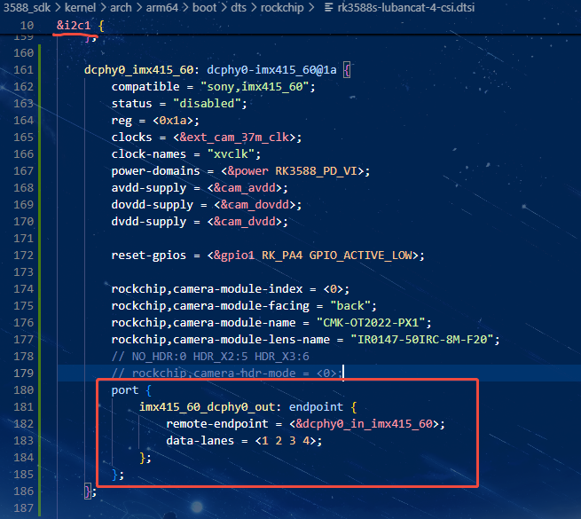
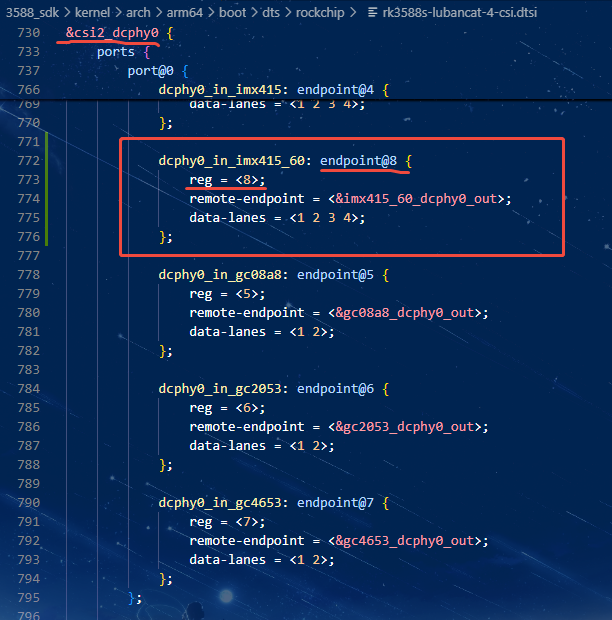
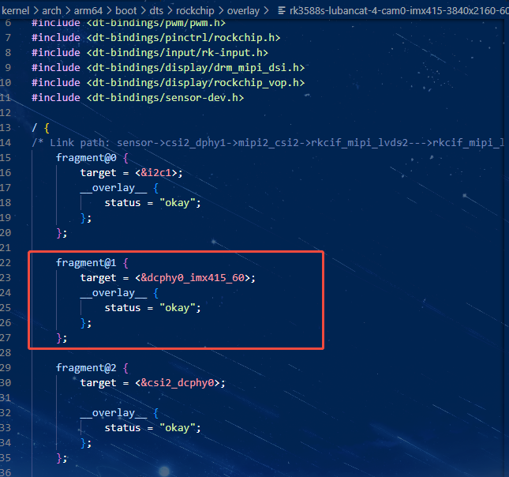
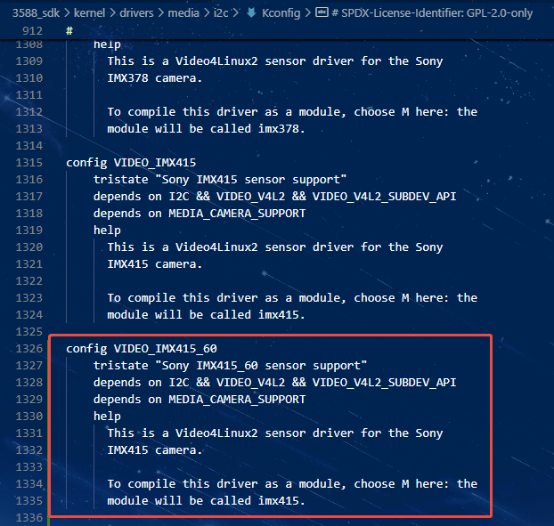
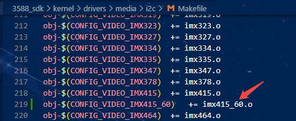
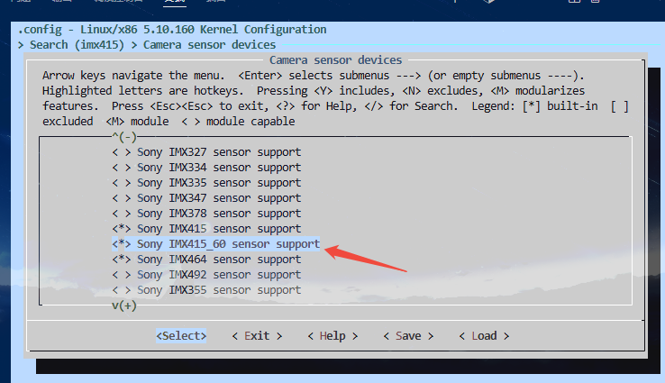
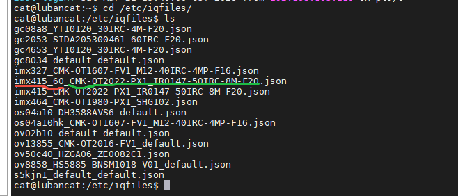

# 0.环境说明
本次移植的环境是rk3588s为主控的鲁班猫4，内核是5.10.160，驱动文件是从其他地方拿过来的，所以用这个演示移植摄像头的方法。

# 1.设备树部分
由于鲁班猫的摄像头设备树部分是在`rk3588s-lubancat-4-csi.dtsi`这个文件里，所以我们可以依葫芦画瓢添加上60fps的imx415节点，添加方法如下：

在i2c1节点添加摄像头配置，在dcphy0节点添加和port节点对应的部分，reg的值不能重复。

再参考imx415的`rk3588s-lubancat-4-cam0-imx415-3840x2160-30fps-overlay.dts`设备树插件，自己新建一个`rk3588s-lubancat-4-cam0-imx415-3840x2160-60fps-overlay.dts`，内容和原来415的设备树插件基本一样，只需要修改一下i2c1开启的节点，如下：

设备树部分就完成了。

# 2.移植驱动到内核
这类通过i2c获取摄像头信息的mipi摄像头驱动放在内核`/kernel/drivers/media/i2c`这个路径，所以我们也要先把`imx415_60.c`这个驱动文件放到这个目录，然后开始修改Kconfig和Makefile。

Kconfig修改如下：

Makefile修改如下:

去内核开启我们移植的配置：

编译内核，烧录，启动系统，测试，会发现isp没有正常工作，因为没有对应的iqfile。
# 3.iqfile配置

进入板卡系统的`/etc/iqfiles`目录，iqfiles的命名是有意义的，如下所示：

红色的部分是摄像头的名字，绿色的部分是设备树里摄像头信息的`rockchip,camera-module-name`和`rockchip,camera-module-lens-name`，用`_`隔开。我们直接复制原imx415的iqfile重命名，重启就生效了。