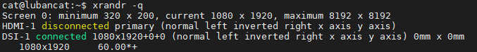
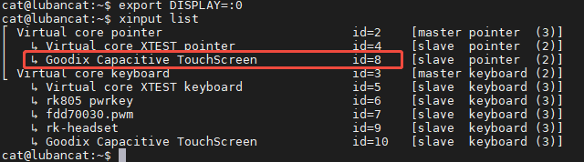

## 0.说明
参考[文档](https://doc.embedfire.com/linux/rk356x/quick_start/zh/latest/quick_start/screen/screen.html#id18)。测试环境是猫2，ubuntu20.04。
## 1.旋转屏幕
### 1.1 显示信息
我这边用ssh做控制，所以按文档操作，从登录界面进入桌面之后输入：
```
export DISPLAY=:0
xrandr -q
DSI-1:mipi屏
HDMI-1：HDMI屏
```
结果如下


### 1.2 触摸信息

```
xinput list
```
结果如下


### 1.3具体做法
参考上面的信息，旋转屏幕就是下面三条命令，这里用向右旋转90度举例：
```
xrandr --output DSI-1 --rotate right

xinput set-prop 8 'Coordinate Transformation Matrix' 0 1 0 -1 0 1 0 0 1

xinput map-to-output 8 DSI-1

```

## 2.自启动
上面的设置，重启后就失效了，这里写一个自启动服务确保他每次开机都能自动旋转屏幕。
#### 2.1 在`/opt`目录创建自启动脚本：
`sudo vi /opt/pingmu.sh`,脚本里添加如下内容
```
#!/bin/bash
export DISPLAY=:0
xrandr --output DSI-1 --rotate right
xinput set-prop 8 'Coordinate Transformation Matrix' 0 1 0 -1 0 1 0 0 1
xinput map-to-output 8 DSI-1
```
添加执行权限：`sudo chmod 0755 /opt/pingmu.sh`
#### 2.2 创建配置文件

在`/etc/systemd/system/`目录下创建一个`pingmu.service`配置文件：

`sudo vi /etc/systemd/system/pingmu.service`

添加如下内容：
```
[Unit]
Description = pingmu daemon

[Service]
ExecStart = /opt/pingmu.sh
Restart = on-failure
RestartSec=3
Type = simple

[Install]
WantedBy = graphical.target
```
使能pingmu.service服务
```shell
sudo systemctl enable pingmu
sudo systemctl start pingmu
```