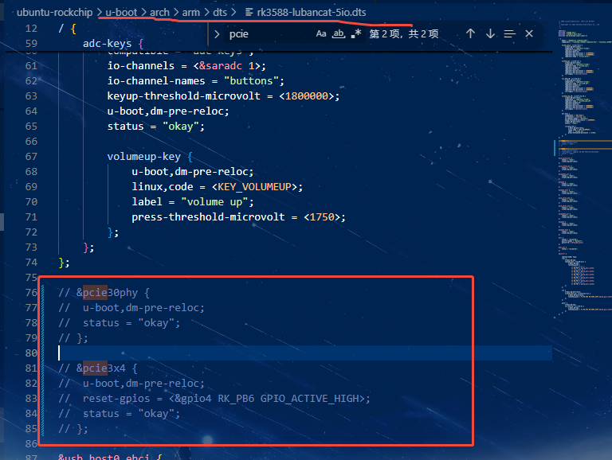
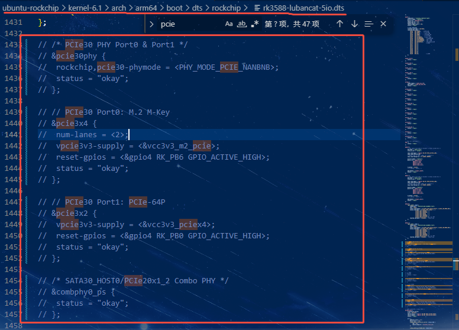
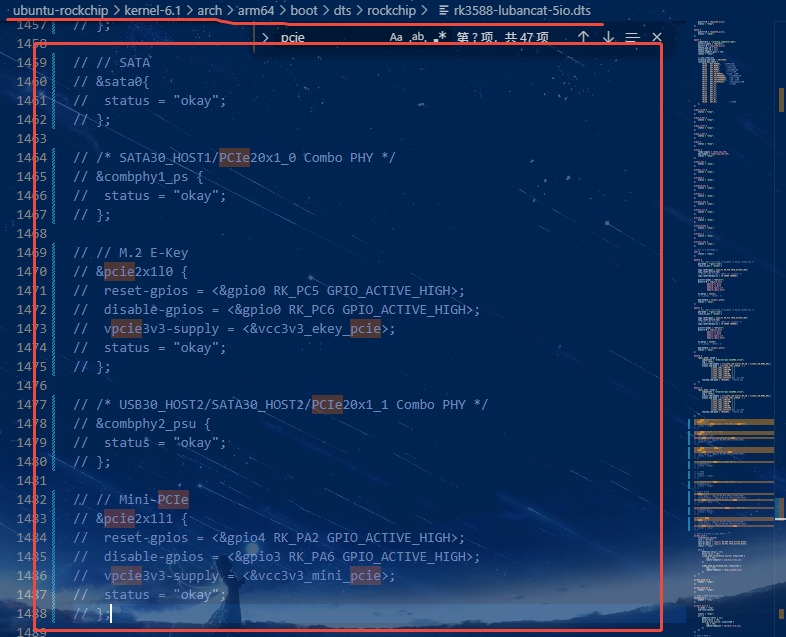

## 0.前言

猫5io自己设计的底板，如果不需要使用pcie，但是没去设备树关掉pcie节点的话，是没办法进系统的，下面以ubuntu22.04的sdk为例子，提供修改设备树的方法。
## 1.uboot的设备树

找到`/ubuntu-rockchip/u-boot/arch/arm/dts/rk3588-lubancat-5io.dts`这个设备树，注释掉pcie相关的节点，不能用disabled关掉，不清楚什么原因这样修改不生效。修改后的设备树如图1所示：


## 2.内核的设备树
找到`/ubuntu-rockchip/kernel-6.1/arch/arm64/boot/dts/rockchip/rk3588-lubancat-5io.dts`这个设备树，注释掉pcie相关的节点，如图2，图3所示：



## 3.编译
修改完成后按照sdk里的README.md编译镜像，注意如果是第一次使用sdk，需要按照README.md安装编译镜像的环境。编译镜像命令如下：
```
sudo ./build.sh --board=lubancat-5io
```