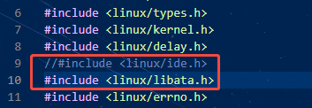
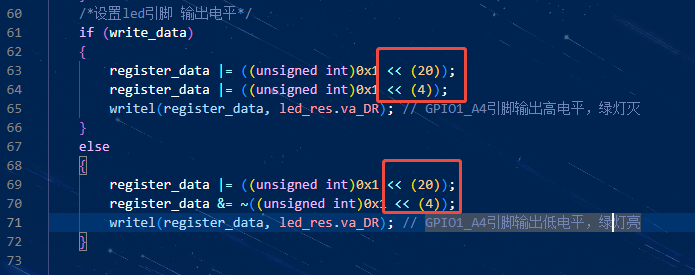
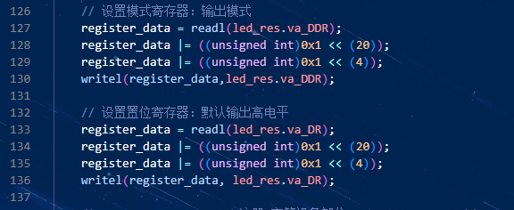

## 0.问题描述
源文档是[Linux设备树——LED灯实验](https://doc.embedfire.com/linux/rk356x/driver/zh/latest/linux_driver/base_device_tree_rgb_led.html#)

设备树和驱动都有需要修改的，这边用猫2v3，6.1.99内核的debian12做测试，下面是要修改的内容。
## 1.设备树
这边为了方便直接用设备树插件替代了，可以用的设备树插件如下：
>rk3568-lubancat-2-v3-devicetree-led.dts
```c
/dts-v1/;
/plugin/;


/{
    fragment@0 {
		target = <&leds>;

		__overlay__ {
			status = "disabled";
            //要关闭主设备树上的led，防止占用。
		};
	};
    

    fragment@1 {
		target-path = "/";

		__overlay__ {
		led_test{
			#address-cells = <2>;
            #size-cells = <1>;
            compatible = "fire,led_test";
			ranges;
            //例程是控制lubancat2V3的系统灯 GPIO1_A4
            led@0xFE740000{   
                    reg = <0x0 0xFE740000 0x4 0x0 0xFE740008 0x4>;  //数据寄存器和数据方向寄存器(低16位)的地址和范围
                    status = "okay";
		            };
	    		};

    };

	};
};
```
其中，`0xFE740000`是gpio1的基地址，可以在3568的trm手册part1找到。

因为是64位的处理器，所以`#address-cells = <2>`。

`ranges;`：表示总线地址 = CPU 物理地址，无需转换。

## 2.驱动程序


因为6.1的内核已经没有了`ide.h`，所以需要注释掉并添加`libata.h`。



write函数这里的位移量根据实际的引脚来修改，因为是A4，所以是4，4+16=20.



probe函数这里相同。

